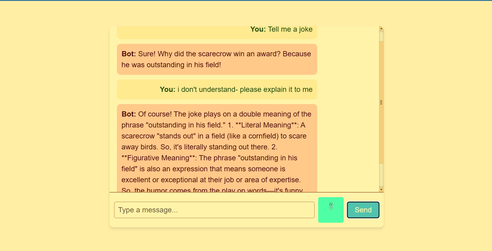

# Chatbot with File Upload and OpenAI Integration
#### This project is a React-based chatbot application integrated with the OpenAI API. It allows users to interact with a chatbot, upload files for context-based conversations, and logs messages for future reference.

## Features
#### Interactive Chat Interface: Chat with an AI assistant using OpenAI's API.
#### File Upload: Upload PDF, DOCX, or TXT files to provide context for chatbot queries.
#### Message Logging: Logs all conversations to a file for monitoring or debugging purposes.
#### Responsive Design: Clean, user-friendly interface with support for scrolling chat history.



## Technologies Used
### Frontend:

React
Axios
CSS for styling
### Backend:

Node.js with Express.js
Multer for file handling
Python for document parsing (via PyPDF2 and python-docx)

### External Services:

## OpenAI API for chatbot responses

## Prerequisites
Before you can run this project, ensure you have the following installed and configured on your system:
+ node.js
+ Python
+ vite
+ OpenAI API key 


#### Setup Instructions
1. Clone the Repository
```bash
git clone <repository-url>
cd chatbot-app
```

2. Install Dependencies
Backend:
Navigate to the backend folder and install dependencies:

```bash
cd backend
npm install
```
Frontend:
Navigate to the frontend folder and install dependencies:

```bash
cd frontend
npm install
```

3. Configure Environment Variables
Create a .env file in the backend directory with the following content:

```makefile
OPENAI_API_KEY=<your-openai-api-key>
```
Replace <your-openai-api-key> with your OpenAI API key.


note\*\* if for some reason it doent work try, setting the key each time the session rolls instead:

```powershell
$Env:OPENAI_API_KEY = <your key>
```

4. Install Python and Required Libraries
Ensure Python is installed and set up in your system. Install the necessary libraries:

```bash
pip install PyPDF2 python-docx
```
5. Run the Application
Start the Backend:
From the backend directory:

```bash
node server.mjs
```

Start the Frontend:
From the frontend directory:

```bash
npm start
```

## Usage
### Interact with the Chatbot:

Enter text in the input field and click "Send" to chat with the AI assistant.
### Upload Files:

Use the paperclip icon (📎) to upload a PDF, DOCX, or TXT file. The chatbot will incorporate the file content into its responses.

### Scroll Through Chat History:

Use the scroll bar to navigate through previous messages.
File Structure
```plaintext
chatbot-app/
├── backend/
│   ├── server.mjs                # Backend server
│   ├── parse_document.py         # Python script for document parsing
│   ├── chat_logs.txt             # (Generated) Log file for conversation history
│   ├── uploads/                  # (Temporary) Folder for uploaded files
│   └── .env                      # Environment variables (contains API key)
├── frontend/
│   ├── src/
│   │   ├── MainTest.jsx          # Main React component
│   │   ├── ChatWindow.jsx        # Chat window component
│   │   ├── App.css               # Styling for the application
│   ├── public/                   # Public assets
│   └── package.json              # Frontend dependencies
└── README.md                     # Documentation
```

## API Endpoints
1. Chat Endpoint
URL: /api/chat
Method: POST
Description: Handles user messages and optional file uploads, responds with AI-generated text.
Request Body:
messages: JSON array of user and assistant messages.
file: Optional file (PDF, DOCX, or TXT) uploaded for context.
Response:
reply: The AI-generated response.


## Limitations


+ Ensure the uploaded file is in a supported format (PDF, DOCX, or TXT) and correctly encoded (UTF-8 or Latin-1 fallback).
OpenAI API Rate Limits:

+ The application is subject to OpenAI API usage limits. Ensure your account has sufficient credits.
Log File Growth:

+ The chat_logs.txt file will grow over time. Consider rotating or archiving logs if needed.
Future Enhancements


## License
This project is licensed under the MIT License. See the LICENSE file for details.

## Acknowledgments
OpenAI API
React
Node.js
Multer